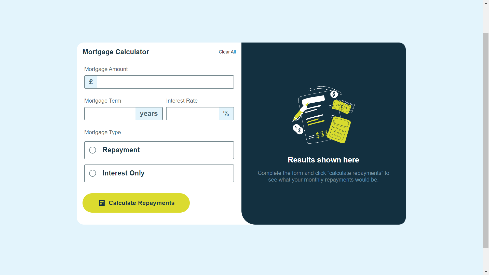

# Frontend Mentor - Mortgage repayment calculator solution

This is a solution to the [Mortgage repayment calculator challenge on Frontend Mentor](https://www.frontendmentor.io/challenges/mortgage-repayment-calculator-Galx1LXK73). 

## Table of contents

- [Overview](#overview)
  - [The challenge](#the-challenge)
  - [Screenshot](#screenshot)
  - [Links](#links)
- [My process](#my-process)
  - [Built with](#built-with)
  - [What I learned](#what-i-learned)
  - [Useful resources](#useful-resources)
- [Author](#author)


## Overview

### The challenge

Users are able to:

- Input mortgage information and see monthly repayment and total repayment amounts after submitting the form
- See form validation messages if any field is incomplete
- Complete the form only using their keyboard
- View the optimal layout for the interface depending on their device's screen size
- See hover and focus states for all interactive elements on the page

### Screenshot




### Links

- Solution URL: [solution URL](https://your-solution-url.com)
- Live Site URL: [live site URL](https://your-live-site-url.com)

## My process

### Built with

- [React](https://reactjs.org/) - JS library
- [Styled Components](https://styled-components.com/) - For styles


### What I learned

What I truly benefited from this challenge was, learning more about state management. Being the first front-end mentor project I was tackling with React I found implementing somethings challenging for Example: 
```js
function handleSelection(selection) {
    setSelected(selection);
    setInputValues((prevValues) => ({ ...prevValues, type: selection }));
  }
```

The above was a function designed to update two states, updating one state based on the value of another state. Ikr looks simple to implement but I tried passing state up which didn't work out fine.

Another part of it that posed a treat was sending the results from the form component state to the results component. Had a create a higher state and then pass the value there first by means of the below function

```js
function updateResult(monthlyResult, totalResult) {
    setResult((prev) => ({
      ...prev,
      monthly: monthlyResult,
      total: totalResult,
    }));
  }
```
which is located in the MortgageApp.jsx file which was passed down as a prop to the form component. 


### Useful resources

I mostly used copilot as it's easier for debugging and it's the new trend. 

I also got some help from statckoverflow as well. (can't beat old habits with new trends)

## Author

- Website - [Louis](https://louis-macjob.vercel.app/)
- Frontend Mentor - [@that-loui](https://www.frontendmentor.io/profile/that-loui)
- Twitter - [@LMacjob](https://www.twitter.com/LMacjob)

